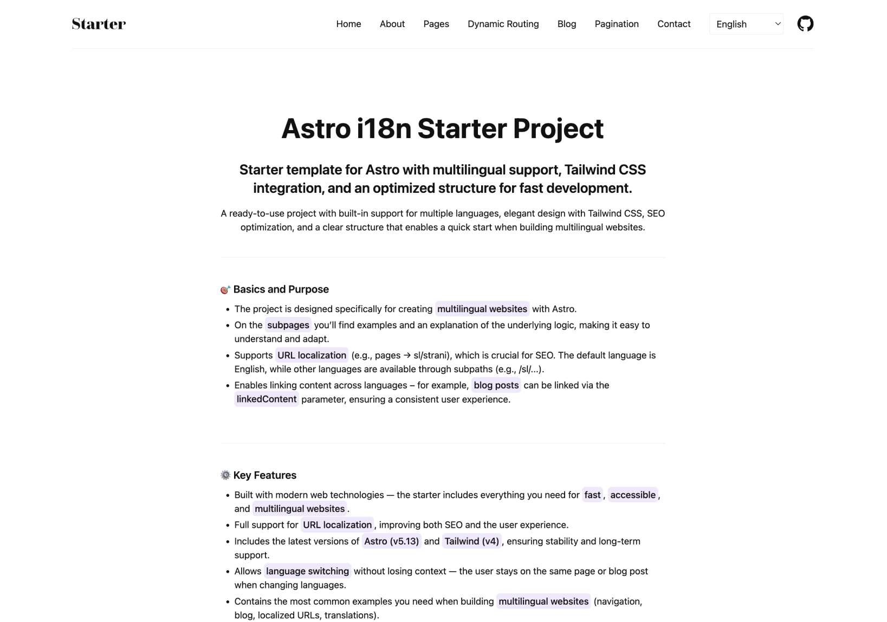

# Astro i18n Starter


**Keywords:** `astro` • `i18n` • `internationalization` • `multilingual` • `url localization` • `seo` • `typescript` • `tailwind css` • `static site generation`

## 🌐 [Live Demo](https://astro-i18n-starter.klemenc.dev)

> Multilingual Astro starter with URL localization support. Complete documentation available at the demo link.

Since Astro doesn't have built-in URL localization out of the box, this starter demonstrates how to implement a complete i18n solution for multilingual projects.

---

> [!TIP]
>
> ## 🚀 Advanced Variant
>
> Looking for a more advanced setup? Check the helper‑based branch (slightly more complex):
>
> -   Dynamic default language
> -   Optional language prefix
>     Link: [https://github.com/Scorpio3310/astro-i18n-starter/tree/feat/i18n-routing-helper](https://github.com/Scorpio3310/astro-i18n-starter/tree/feat/i18n-routing-helper)

---

## ✨ Features

This project implements a comprehensive internationalization (i18n) system that includes:

✅ **SEO-friendly URLs** in multiple languages (`/about` → `/sl/o-projektu`)  
✅ **Static generation** at build time with dynamic routing  
✅ **Language-specific content** loading and management  
✅ **Translation system** integration with namespace support  
✅ **Smart language switching** with context preservation  
✅ **Blog system** with multilingual posts and pagination  
✅ **Component examples** with Svelte 5 integration  
✅ **Accessibility features** with proper ARIA attributes  
✅ **SEO optimization** with meta tags and keywords

**Perfect for:** Projects requiring complete URL localization alongside content translation



---

## 🛠️ Tech Stack

-   **Framework**: [Astro 5.13](https://astro.build/) - Static site generator
-   **Components**: [Svelte 5](https://svelte.dev/) - Interactive components with runes
-   **Styling**: [Tailwind CSS](https://tailwindcss.com/) - Utility-first CSS
-   **Content**: Astro Content Collections - Type-safe markdown content
-   **Images**: Astro Assets - Optimized image processing

---

## 🚀 Quick Start

### 1. Clone & Install

```bash
# Clone the repository
git clone https://github.com/Scorpio3310/astro-i18n-starter.git
cd astro-i18n-starter

# Install dependencies
pnpm install
```

### 2. Environment Setup

```bash
# Copy environment file
cp .env.example .env

# Edit .env with your production domain
PRODUCTION_DOMAIN = "https://your-domain.com"
```

### 3. Development Server

```bash
# Start development server
pnpm run dev
```

Visit `http://localhost:4321` to see your multilingual site!

---

## 📁 Project Structure

```
/
├── public/              # Static assets
├── src/
│   ├── assets/          # Assets
│   ├── components/      # Reusable components
│   ├── content/         # Content collections (blog, authors)
│   ├── data/            # Navigation and configuration
│   ├── i18n/            # Translation utilities and routes
│   ├── layouts/         # Page layouts
│   ├── locales/         # Translation files (en, sl)
│   ├── pages/           # File-based routing with [dynamic] params
│   ├── styles/          # Global styles
│   └── utils/           # Utility functions
```

---

## 🌍 How URL Localization Works

The system uses dynamic routing with file-based structure:

```
English:    /about          → src/pages/[about]/[...index].astro
Slovenian:  /sl/o-projektu  → src/pages/[about]/[...index].astro
```

**Route Configuration:**

```typescript
// src/i18n/routes.ts
export const routes = {
    en: { about: "about", blog: "blog" },
    sl: { about: "o-projektu", blog: "spletni-dnevnik" },
};
```

**Dynamic Path Generation:**

```astro
export function getStaticPaths() {
  return [
    { params: { about: "about" }, props: { lang: "en" } },
    { params: { about: "/sl/o-projektu" }, props: { lang: "sl" } }
  ];
}
```

---

## 📝 Adding New Pages

1. **Create page file**: `src/pages/[your-route]/[...index].astro`
2. **Add route translations**: Update `src/i18n/routes.ts`
3. **Add translations**: Create files in `src/locales/en/` and `src/locales/sl/`
4. **Update navigation**: Modify `src/data/navigationData.ts`

Detailed documentation with examples is available in the demo site.

---

## 🔧 Environment Variables

```bash
# .env
PRODUCTION_DOMAIN = "https://your-domain.com"  # Used to enable robots.txt
```

**Important:** Set your production domain for proper:

-   Open Graph images in social media
-   Canonical URLs for SEO
-   Search engine indexing control

---

## 🚢 Deployment

### Build for Production

```bash
pnpm run build
```

### Preview Build

```bash
pnpm run preview
```

The site generates static files optimized for any hosting provider (Netlify, Vercel, Cloudflare Pages, etc.).

---

## 📋 Roadmap

These items are maintained in the advanced helper‑based branch:

-   [x] ~~Dynamic default language~~
-   [x] ~~Optional language prefix~~

updates: https://github.com/Scorpio3310/astro-i18n-starter/tree/feat/i18n-routing-helper

---

## 🤝 Contributing

1. Fork the repository
2. Create a feature branch (`git checkout -b feature/amazing-feature`)
3. Make your changes
4. Test locally with `pnpm run build && pnpm run preview`
5. Commit your changes (`git commit -m 'Add amazing feature'`)
6. Push to the branch (`git push origin feature/amazing-feature`)
7. Open a Pull Request

---

## 📄 License

This project is licensed under the MIT License - see the [LICENSE](LICENSE) file for details.

---

## 🙏 Acknowledgments

-   [Astro](https://astro.build/) - Amazing static site generator
-   [Svelte](https://svelte.dev/) - Excellent component framework
-   [Tailwind CSS](https://tailwindcss.com/) - Great utility CSS framework
